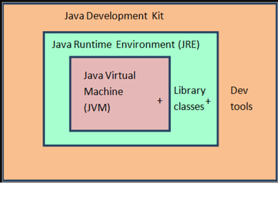

# Java Intro

[cite\_start]Java is one of the most in-demand programming languages in the world and one of the two official programming languages used for Android development[cite: 2]. [cite\_start]Although it is a pure object-oriented language, Java has evolved into a multi-paradigm language, making it highly compliant for various situations[cite: 3]. [cite\_start]Developers who are familiar with Java can create a wide range of applications, games, and tools[cite: 3].

[cite\_start]This guide will help you begin your journey with Java and become an accomplished Java developer[cite: 5].

-----

## What is Java?

[cite\_start]Java is a high-level, object-oriented, general-purpose programming language that was created by Sun Microsystems (now owned by Oracle) in 1995[cite: 7].

[cite\_start]It was designed to be[cite: 8]:

* [cite\_start]**Platform-independent**: The Java Virtual Machine (JVM) allows Java code to run on any device that has a JVM installed, which is known as “write once, run anywhere”[cite: 9].
* [cite\_start]**Robust and secure**: Java has built-in security features and automatically handles memory management[cite: 10].
* [cite\_start]**Multithreaded**: It supports concurrent execution, which makes it ideal for performance-heavy applications[cite: 11].
* [cite\_start]**Class-based and strongly typed**: The language revolves around classes and objects and has strict type checking[cite: 12].

-----

## Common Usage of Java

* Android app development [cite: 14]
* Enterprise software (logistics, banking, etc.) [cite: 15]
* Web applications (using Spring, JSP) [cite: 16]
* Embedded systems and IoT [cite: 17]
* Game development and scientific computing [cite: 18]

-----

## Architecture of Java

* **JDK** = JRE + Development utilities
* **JRE** = JVM + libraries  

-----

## How a Java Program Runs

[cite\_start]Java programmers simply write the code, and it runs on the Java Virtual Machine (JVM)[cite: 23].

-----

### Java Compiler

[cite\_start]The Java compiler takes a **Java Program (.java)** file and converts it into **bytecode (.class)**[cite: 26].

[cite\_start]This created `.class` file is then used as input for the JVM[cite: 27].

-----

## Properties of Java

* [cite\_start]**Statically Typed**: Any variable declared in a Java program must be bound to a specific type of value, and this type cannot change unless it is reassigned[cite: 30].
* [cite\_start]**Usually Just-in-Time (JIT) Compiled**: A Java program is first converted into bytecode before it is executed[cite: 32]. [cite\_start]The JIT compiler then converts the bytecode into machine instructions while the program is being run[cite: 33].
* [cite\_start]**Includes a Variety of Libraries**: A "library is a collection of commonly used programming resources"[cite: 35].
* [cite\_start]**Has a Built-in Garbage Collector**: This process periodically scans the heap memory to identify and clean up unused objects[cite: 37, 38]. [cite\_start]An unused object is one that is not being referenced by any part of a running program[cite: 39].
* [cite\_start]**Has a Number of Related Languages**: Several languages, such as Groovy, Scala, Kotlin, and Clojure, have compilers that translate their source code into JVM bytecode[cite: 41, 42].